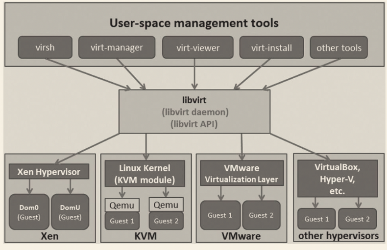

# libvirt 简介



在 libvirt 中涉及几个重要的概念，解释如下：

- 节点（Node）是一个物理机器，上面可能运行着多个虚拟客户机。Hypervisor 和 Domain 都运行在节点上。
- Hypervisor 也称虚拟机监控器（VMM），如 KVM、Xen、VMware、Hyper-V 等，是虚拟化中的一个底层软件层，它可以虚拟化一个节点让其运行多个虚拟客户机（不同客户机可能有不同的配置和操作系统）。
- “域（Domain）是在 Hypervisor 上运行的一个客户机操作系统实例。域也被称为实例（instance，如在亚马逊的 AWS 云计算服务中客户机就被称为实例）、客户机操作系统（guest OS）、虚拟机（virtual machine），它们都是指同一个概念。

节点、Hypervisor 和域的关系可以简单地用图 4-2 来表示。


在了解了节点、Hypervisor 和域的概念之后，用一句话概括 libvirt 的目标，那就是：为了安全高效地管理节点上的各个域，而提供一个公共的稳定的软件层。当然，这里的管理，既包括本地的管理，也包含远程的管理。具体地讲，libvirt 的管理功能主要包含如下 5 个部分。

1. 域的管理 。包括对节点上的域的各个生命周期的管理，如启动、停止、暂停、保存、恢复和动态迁移。还包括对多种设备类型的热插拔操作，包括磁盘、网卡、内存和 CPU。当然不同的 Hypervisor 上对这些热插拔的支持程度有所不同。
2. 远程节点的管理 。只要物理节点上运行了 libvirtd 这个守护进程，远程的管理程序就可以连接到该节点进程管理操作，经过认证和授权之后，所有的 libvirt 功能都可以被访问和使用。libvirt 支持多种网络远程传输类型，如 SSH、TCP 套接字、Unix domain socket、TLS 的加密传输等。假设使用了最简单的 SSH，不需要额外的配置工作，比如，在 example.com 节点上运行了 libvirtd，而且允许 SSH 访问，在远程的某台管理机器上就可以用如下的命令行来连接到 example.com 上，从而管理其上的域。
3. 存储的管理 。任何运行了 libvirtd 守护进程的主机，都可以通过 libvirt 来管理不同类型的存储，如创建不同格式的客户机镜像（qcow2、raw、qde、vmdk 等）、挂载 NFS 共享存储系统、查看现有的 LVM 卷组、创建新的 LVM 卷组和逻辑卷、对磁盘设备分区、挂载 iSCSI 共享存储、使用 Ceph 系统支持的 RBD 远程存储，等等。当然在 libvirt 中，对存储的管理也是支持远程的。
4. 网络的管理 。任何运行了 libvirtd 守护进程的主机，都可以通过 libvirt 来管理物理的和逻辑的网络接口。包括列出现有的网络接口卡，配置网络接口，创建虚拟网络接口，网络接口的桥接，VLAN 管理，NAT 网络设置，为客户机分配虚拟网络接口，等等。
5. 提供一个稳定、可靠、高效的应用程序接口，以便可以完成前面的 4 个管理功能。libvirt 主要由 3 个部分组成，分别是：应用程序编程接口库、一个守护进程（libvirtd）和一个默认命令行管理工具（virsh）。应用程序接口是为其他虚拟机管理工具（如 virsh、virt-manager 等）提供虚拟机管理的程序库支持。libvirtd 守护进程负责执行对节点上的域的管理工作，在用各种工具对虚拟机进行管理时，这个守护进程一定要处于运行状态中。而且这个守护进程可以分为两种：一种是 root 权限的 libvirtd，其权限较大，可以完成所有支持的管理工作；一种是普通用户权限的 libvirtd，只能完成比较受限的管理工作。

## libvirt 配置文件

```
# nn @ nn in /etc/libvirt [15:50:17] 
$ tree
.
├── hooks
├── libvirt-admin.conf
├── libvirt.conf
├── libvirtd.conf
├── libxl.conf
├── libxl-lockd.conf
├── libxl-sanlock.conf
├── lxc.conf
├── nwfilter
│   ├── allow-arp.xml
│   ├── allow-dhcp-server.xml
│   ├── allow-dhcp.xml
│   ├── allow-incoming-ipv4.xml
│   ├── allow-ipv4.xml
│   ├── clean-traffic-gateway.xml
│   ├── clean-traffic.xml
│   ├── no-arp-ip-spoofing.xml
│   ├── no-arp-mac-spoofing.xml
│   ├── no-arp-spoofing.xml
│   ├── no-ip-multicast.xml
│   ├── no-ip-spoofing.xml
│   ├── no-mac-broadcast.xml
│   ├── no-mac-spoofing.xml
│   ├── no-other-l2-traffic.xml
│   ├── no-other-rarp-traffic.xml
│   ├── qemu-announce-self-rarp.xml
│   └── qemu-announce-self.xml
├── qemu
│   ├── networks
│   │   ├── autostart
│   │   │   └── default.xml -> /etc/libvirt/qemu/networks/default.xml
│   │   └── default.xml
│   └── QEMU-fedora-i686.xml
├── qemu.conf
├── qemu-lockd.conf
├── qemu-sanlock.conf
├── secrets [error opening dir]
├── virtlockd.conf
├── virtlogd.conf
└── virt-login-shell.conf

6 directories, 34 files
```

### /etc/libvirt/libvirt.conf

```sh
# nn @ nn in /etc/libvirt [15:50:23] 
$ cat libvirt.conf 
#
# This can be used to setup URI aliases for frequently
# used connection URIs. Aliases may contain only the
# characters  a-Z, 0-9, _, -.
#
# Following the '=' may be any valid libvirt connection
# URI, including arbitrary parameters

#uri_aliases = [
#  "hail=qemu+ssh://root@hail.cloud.example.com/system",
#  "sleet=qemu+ssh://root@sleet.cloud.example.com/system",
#]

#
# These can be used in cases when no URI is supplied by the application
# (@uri_default also prevents probing of the hypervisor driver).
#
#uri_default = "qemu:///system"
uri_aliases = [
        "remote1=qemu+ssh://root@192.168.93.201/system",
]
```

libvirt.conf 文件用于配置一些常用 libvirt 连接（通常是远程连接）的别名。其中，配置了 remote1 这个别名，用于指代 qemu+ssh：//root@192.168.93.201/system 这个远程的 libvirt 连接。有这个别名后，就可以在用 virsh 等工具或自己写代码调用 libvirt API 时使用这个别名，而不需要写完整的、冗长的 URI 连接标识了。用 virsh 使用这个别名，连接到远程的 libvirt 上查询当前已经启动的客户机状态，然后退出连接。

### /etc/libvirt/libvirtd.conf

libvirtd.conf 是 libvirt 的守护进程 libvirtd 的配置文件，被修改后需要让 libvirtd 重新加载配置文件（或重启 libvirtd）才会生效。在 libvirtd.conf 中配置了 libvirtd 启动时的许多设置，包括是否建立 TCP、UNIX domain socket 等连接方式及其最大连接数，以及这些连接的认证机制，设置 libvirtd 的日志级别等。

例如，下面的几个配置项表示关闭 TLS 安全认证的连接（默认值是打开的），打开 TCP 连接（默认是关闭 TCP 连接的），设置 TCP 监听的端口，TCP 连接不使用认证授权方式，设置 UNIX domain socket 的保存目录等。

```
listen_tls = 0
listen_tcp = 1
tcp_port = "16666"
unix_sock_dir = "/var/run/libvirt"
auth_tcp = "none"
```

### /etc/libvirt/qemu.conf

qemu.conf 是 libvirt 对 QEMU 的驱动的配置文件，包括 VNC、SPICE 等，以及连接它们时采用的权限认证方式的配置，也包括内存大页、SELinux、Cgroups 等相关配置。

### /etc/libvirt/qemu/ 文件夹

在 qemu 目录下存放的是使用 QEMU 驱动的域的配置文件。

```
├── qemu
│   ├── networks
│   │   ├── autostart
│   │   │   └── default.xml -> /etc/libvirt/qemu/networks/default.xml
│   │   └── default.xml
│   └── QEMU-fedora-i686.xml
```

其中包括了一个域的 XML 配置文件（QEMU-fedora-i686.xml），这就是使用 virsh define 命令创建出来的域，默认会将其配置文件保存到/etc/libvirt/qemu/目录下。而其中的 networks 目录保存了创建一个域时默认使用的网络配置。

```sh
# nn @ nn in /etc/libvirt/qemu [16:25:10] C:1
$ sudo cat QEMU-fedora-i686.xml 
<!--
WARNING: THIS IS AN AUTO-GENERATED FILE. CHANGES TO IT ARE LIKELY TO BE
OVERWRITTEN AND LOST. Changes to this xml configuration should be made using:
  virsh edit QEMU-fedora-i686
or other application using the libvirt API.
-->

<domain type='qemu'>
  <name>QEMU-fedora-i686</name>
  <uuid>c7a5fdbd-cdaf-9455-926a-d65c16db1809</uuid>
  <memory unit='KiB'>219200</memory>
  <currentMemory unit='KiB'>219200</currentMemory>
  <vcpu placement='static'>2</vcpu>
  <os>
    <type arch='i686' machine='pc-i440fx-4.2'>hvm</type>
    <boot dev='cdrom'/>
  </os>
  <cpu mode='custom' match='exact' check='none'>
    <model fallback='forbid'>qemu64</model>
  </cpu>
  <clock offset='utc'/>
  <on_poweroff>destroy</on_poweroff>
  <on_reboot>restart</on_reboot>
  <on_crash>destroy</on_crash>
  <devices>
    <emulator>/usr/bin/qemu-system-x86_64</emulator>
    <disk type='file' device='disk'>
      <driver name='qemu' type='raw'/>
      <source file='/home/user/fedora.img'/>
      <target dev='hda' bus='ide'/>
      <address type='drive' controller='0' bus='0' target='0' unit='0'/>
    </disk>
    <disk type='file' device='cdrom'>
      <driver name='qemu' type='raw'/>
      <source file='/home/user/boot.iso'/>
      <target dev='hdc' bus='ide'/>
      <readonly/>
      <address type='drive' controller='0' bus='1' target='0' unit='0'/>
    </disk>
    <controller type='usb' index='0' model='piix3-uhci'>
      <address type='pci' domain='0x0000' bus='0x00' slot='0x01' function='0x2'/>
    </controller>
    <controller type='pci' index='0' model='pci-root'/>
    <controller type='ide' index='0'>
      <address type='pci' domain='0x0000' bus='0x00' slot='0x01' function='0x1'/>
    </controller>
    <interface type='network'>
      <mac address='52:54:00:0d:cd:f7'/>
      <source network='default'/>
      <model type='rtl8139'/>
      <address type='pci' domain='0x0000' bus='0x00' slot='0x03' function='0x0'/>
    </interface>
    <input type='mouse' bus='ps2'/>
    <input type='keyboard' bus='ps2'/>
    <graphics type='vnc' port='-1' autoport='yes'>
      <listen type='address'/>
    </graphics>
    <video>
      <model type='cirrus' vram='16384' heads='1' primary='yes'/>
      <address type='pci' domain='0x0000' bus='0x00' slot='0x02' function='0x0'/>
    </video>
    <memballoon model='virtio'>
      <address type='pci' domain='0x0000' bus='0x00' slot='0x04' function='0x0'/>
    </memballoon>
  </devices>
</domain>
```

使用的原始文件为：

```sh
# nn @ nn in ~/work [16:26:02] 
$ cat kvm1.xml            
<domain type='qemu'>
    <name>QEMU-fedora-i686</name>
    <uuid>c7a5fdbd-cdaf-9455-926a-d65c16db1809</uuid>
    <memory>219200</memory>
    <currentMemory>219200</currentMemory>
    <vcpu>2</vcpu>
    <os>
      <type arch='i686' machine='pc'>hvm</type>
      <boot dev='cdrom'/>
    </os>
    <devices>
      <emulator>/usr/bin/qemu-system-x86_64</emulator>
      <disk type='file' device='cdrom'>
        <source file='/home/user/boot.iso'/>
        <target dev='hdc'/>
        <readonly/>
      </disk>
      <disk type='file' device='disk'>
        <source file='/home/user/fedora.img'/>
        <target dev='hda'/>
      </disk>
      <interface type='network'>
        <source network='default'/>
      </interface>
      <graphics type='vnc' port='-1'/>
    </devices>
  </domain>
```

## libvirt 使用

libvirtd 是一个作为 libvirt 虚拟化管理系统中的服务器端的守护程序，要让某个节点能够利用 libvirt 进行管理（无论是本地还是远程管理），都需要在这个节点上运行 libvirtd 这个守护进程，以便让其他上层管理工具可以连接到该节点，libvirtd 负责执行其他管理工具发送给它的虚拟化管理操作指令。而 libvirt 的客户端工具（包括 virsh、virt-manager 等）可以连接到本地或远程的 libvirtd 进程，以便管理节点上的客户机（启动、关闭、重启、迁移等）、收集节点上的宿主机和客户机的配置和资源使用状态。

常用的操作方式有：

- “systemctl start libvirtd”命令表示启动 libvirtd
- “systemctl restart libvirtd”表示重启 libvirtd
- “systemctl reload libvirtd”表示不重启服务但重新加载配置文件（即/etc/libvirt/libvirtd.conf 配置文件）
- “systemctl status libvirtd”表示查询 libvirtd 服务的运行状态。

在默认情况下，libvirtd 在监听一个本地的 Unix domain socket，而没有监听基于网络的 TCP/IP socket，需要使用“-l 或--listen”的命令行参数来开启对 libvirtd.conf 配置文件中 TCP/IP socket 的配置。另外，libvirtd 守护进程的启动或停止，并不会直接影响正在运行中的客户机。libvirtd 在启动或重启完成时，只要客户机的 XML 配置文件是存在的，libvirtd 会自动加载这些客户的配置，获取它们的信息。当然，如果客户机没有基于 libvirt 格式的 XML 文件来运行（例如直接使用 qemu 命令行来启动的客户机），libvirtd 则不能自动发现它。

libvirtd 是一个可执行程序，不仅可以使用“systemctl”命令调用它作为服务来运行，而且可以单独地运行 libvirtd 命令来使用它。下面介绍几种 libvirtd 命令行的参数。

（1）-d 或--daemon

表示让 libvirtd 作为守护进程（daemon）在后台运行。

（2）-f 或--config FILE

指定 libvirtd 的配置文件为 FILE，而不是使用默认值（通常是/etc/libvirt/libvirtd.conf）。

（3）-l 或--listen

开启配置文件中配置的 TCP/IP 连接。

（4）-p 或--pid-file FILE

将 libvirtd 进程的 PID 写入 FILE 文件中，而不是使用默认值（通常是/var/run/libvirtd.pid）。

（5）-t 或--timeout SECONDS

设置对 libvirtd 连接的超时时间为 SECONDS 秒。

（6）-v 或--verbose

执行命令输出详细的输出信息。特别是在运行出错时，详细的输出信息便于用户查找原因。

（7）--version

显示 libvirtd 程序的版本信息。

## libvirt 域的 XML 配置文件

### CPU 配置

```xml
<vcpu placement='static'>2</vcpu> 
<features>
    <acpi/>
    <apic/>
</features>
<cpu mode='custom' match='exact'>
    <model fallback='allow'>Haswell-noTSX</model>
</cpu>
```

vcpu 标签，表示客户机中 vCPU 的个数，这里为 2。

features 标签，表示 Hypervisor 为客户机打开或关闭 CPU 或其他硬件的特性，这里打开了 ACPI、APIC 等特性。当然，CPU 的基础特性是在 cpu 标签中定义的，这里是之前创建客户机时，libvirt 自动检测了 CPU 硬件平台，默认使用了 Haswell 的 CPU 给客户机。

对于这里看到的 CPU 模型：Haswell-noTSX，可以在文件/usr/share/libvirt/cpu_map.xml 中查看详细描述。该 CPU 模型中的特性（如 SSE2、LM、NX、TSC、AVX2、SMEP 等）也是该客户机可以看到和使用的特性。

对于 CPU 模型的配置，有以下 3 种模式。

- custom 模式：就是这里示例中表示的，基于某个基础的 CPU 模型，再做个性化的设置。
- host-model 模式：根据物理 CPU 的特性，选择一个与之最接近的标准 CPU 型号，如果没有指定 CPU 模式，默认也是使用这种模式。xml 配置文件为：`<cpu mode='host-model'/>`。
- host-passthrough 模式：直接将物理 CPU 特性暴露给虚拟机使用，在虚拟机上看到的完全就是物理 CPU 的型号。xml 配置文件为：`<cpu mode='host-passthrough'/>`。

对 vCPU 的分配，可以有更细粒度的配置，如下：

```
<domain>
    ...
    <vcpu placement='static' cpuset="1-4,^3,6" current="1">2</vcpu>
    ...
</domain>
```

cpuset 表示允许到哪些物理 CPU 上执行，这里表示客户机的两个 vCPU 被允许调度到 1、2、4、6 号物理 CPU 上执行（^3 表示排除 3 号）；而 current 表示启动客户机时只给 1 个 vCPU，最多可以增加到使用 2 个 vCPU。

当然，libvirt 还提供 cputune 标签来对 CPU 的分配进行更多调节，如下：

```
<domain>
    ...
    <cputune>
        <vcpupin vcpu="0" cpuset="1"/>
        <vcpupin vcpu="1" cpuset="2,3"/>
        <vcpupin vcpu="2" cpuset="4"/>
        <vcpupin vcpu="3" cpuset="5"/>
        <emulatorpin cpuset="1-3"/>
        <shares>2048</shares>
        <period>1000000</period>
        <quota>-1</quota>
        <emulator_period>1000000</emulator_period>
        <emulator_quota>-1</emulator_quota>
    </cputune>
    ...
</domain>
```

这里只简单解释其中几个配置：vcpupin 标签表示将虚拟 CPU 绑定到某一个或多个物理 CPU 上，如：

- `<vcpupin vcpu="2"cpuset="4"/>`表示客户机 2 号虚拟 CPU 被绑定到 4 号物理 CPU 上；
- `<emulatorpin cpuset="1-3"/>`表示将 QEMU emulator 绑定到 1~3 号物理 CPU 上。在不设置任何 vcpupin 和 cpuset 的情况下，客户机的虚拟 CPU 可能会被调度到任何一个物理 CPU 上去运行。
- `<shares>2048</shares>`表示客户机占用 CPU 时间的加权配置，一个配置为 2048 的域获得的 CPU 执行时间是配置为 1024 的域的两倍。如果不设置 shares 值，就会使用宿主机系统提供的默认值。

### 内存配置

```xml
<memory unit='KiB'>2097152</memory>
<currentMemory unit='KiB'>2097152</currentMemory>
```

可知，内存大小为 2 097 152KB（即 2GB），memory 标签中的内存表示客户机最大可使用的内存，currentMemory 标签中的内存表示启动时即分配给客户机使用的内存。在使用 QEMU/KVM 时，一般将二者设置为相同的值。

另外，内存的 ballooning 相关的配置包含在 devices 这个标签的 memballoon 子标签中，该标签配置了该客户机的内存气球设备，如下：

```
<memballoon model='virtio'>
    <address type='pci' domain='0x0000' bus='0x00' slot='0x08' function='0x0'/>
</memballoon>
```

该配置将为客户机分配一个使用 virtio-balloon 驱动的设备，以便实现客户机内存的 ballooning 调节。该设备在客户机中的 PCI 设备编号为 0000：00：08.0。

### 客户机系统类型和启动顺序

客户机系统类型及其启动顺序在 os 标签中配置，如下：

```
<os>
    <type arch='x86_64' machine='pc-i440fx-rhel7.0.0'>hvm</type>
    <boot dev='hd'/>
    <boot dev='cdrom'/>
</os>
```

这样的配置表示客户机类型是 hvm 类型，HVM（hardware virtual machine，硬件虚拟机）原本是 Xen 虚拟化中的概念，它表示在硬件辅助虚拟化技术（Intel VT 或 AMD-V 等）的支持下不需要修改客户机操作系统就可以启动客户机。因为 KVM 一定要依赖于硬件虚拟化技术的支持，所以在 KVM 中，客户机类型应该总是 hvm，操作系统的架构是 x86_64，机器类型是 pc-i440fx-rhel7.0.0（这是 libvirt 中针对 RHEL 7 系统的默认类型，也可以根据需要修改为其他类型）。boot 选项用于设置客户机启动时的设备，这里有 hd（即硬盘）和 cdrom（光驱）两种，而且是按照硬盘、光驱的顺序启动的，它们在 XML 配置文件中的先后顺序即启动时的先后顺序。

### 网络配置

#### 桥接方式的网络配置

在域的 XML 配置中，使用桥接方式的网络的相关配置如下：

```
<devices>
    ...
    <interface type='bridge'>
        <mac address='52:54:00:e9:e0:3b'/>
        <source bridge='br0'/>
        <model type='virtio'/>
        <address type='pci' domain='0x0000' bus='0x00' slot='0x03' function='0x0'/>
    </interface>
    ...
</devices>
```

type='bridge'表示使用桥接方式使客户机获得网络，address 用于配置客户机中网卡的 MAC 地址，`<source bridge='br0'/>`表示使用宿主机中的 br0 网络接口来建立网桥，`<model type='virtio'/>`表示在客户机中使用 virtio-net 驱动的网卡设备，也配置了该网卡在客户机中的 PCI 设备编号为 0000：00：03.0。

#### NAT 方式的虚拟网络配置

在域的 XML 配置中，NAT 方式的虚拟网络的配置示例如下：

```
<devices>
    ...
    <interface type='network'>
        <mac address='52:54:00:32:7d:f6'/>
        <source network='default'/>
        <address type='pci' domain='0x0000' bus='0x00' slot='0x03' function='0x0'/>
    </interface>
    ...
</devices>
```

这里`type='network'`和`<source network='default'/>`表示使用 NAT 的方式，并使用默认的网络配置，客户机将会分配到 192.168.122.0/24 网段中的一个 IP 地址。当然，使用 NAT 必须保证宿主机中运行着 DHCP 和 DNS 服务器，一般默认使用 dnsmasq 软件查询。查询 DHCP 和 DNS 服务的运行的命令行如下：

```
[root@kvm-host ~]# ps -ef | grep dnsmasq
nobody    1863     1  0 Dec08 ?        00:00:03 /usr/sbin/dnsmasq --strict-order --bind-interfaces --pid-file=/var/run/libvirt/network/default.pid --conf-file= --except-interface lo --listen-address 192.168.122.1 --dhcp-range 192.168.122.2,192.168.122.254 --dhcp-leasefile=/var/lib/libvirt/dnsmasq/default.leases --dhcp-lease-max=253 --dhcp-no-override
```

由于配置使用了默认的 NAT 网络配置，可以在 libvirt 相关的网络配置中看到一个 default.xml 文件（/etc/libvirt/qemu/networks/default.xml），它具体配置了默认的连接方式，如下：

```
<network>
    <name>default</name>
    <bridge name="virbr0" />
    <forward/>
    <ip address="192.168.122.1" netmask="255.255.255.0">
        <dhcp>
            <range start="192.168.122.2" end="192.168.122.254" />
        </dhcp>
    </ip>
</network>
```

在使用 NAT 时，查看宿主机中网桥的使用情况如下：

```
[root@kvm-host ~]# brctl show
bridge name     bridge id               STP enabled     interfaces
virbr0          8000.525400b45ba5       yes             virbr0-nic
                                                             vnet0
```

其中 vnet0 这个网络接口就是客户机和宿主机网络连接的纽带。

#### 用户模式网络的配置

在域的 XML 文件中，如下的配置即实现了使用用户模式的网络。

```
<devices>
    ...
    <interface type='user'>
        <mac address="00:11:22:33:44:55"/>
    </interface>
    ...
</devices>
```

其中，type='user'表示该客户机的网络接口是用户模式网络，是完全由 QEMU 软件模拟的一个网络协议栈。在宿主机中，没有一个虚拟的网络接口连接到 virbr0 这样的网桥。

#### 网卡设备直接分配（VT-d）

在客户机的网络配置中，还可以采用 PCI/PCI-e 网卡将设备直接分配给客户机使用。关于设备直接分配的细节，可以参考 6.2 节中的介绍，本节只介绍其在 libvirt 中的配置方式。对于设备直接分配的配置在域的 XML 配置文件中有两种方式：一种是较新的方式，使用`<interface type='hostdev'/>`标签；另一种是较旧但支持设备很广泛的方式，直接使用`<hostdev>`标签。

`<interface type='hostdev'/>`标签是较新的配置方式，目前仅支持 libvirt 0.9.11 以上的版本，而且仅支持 SR-IOV 特性中的 VF 的直接配置。在`<interface type='hostdev'/>`标签中，用`<driver name='vfio'/>`指定使用哪一种分配方式（默认是 VFIO，如果使用较旧的传统的 device assignment 方式，这个值可配为'kvm'），用`<source>`标签来指示将宿主机中的哪个 VF 分配给宿主机使用，还可使用`<mac address='52：54：00：6d：90：02'>`来指定在客户机中看到的该网卡设备的 MAC 地址。一个示例配置如下所示，它表示将宿主机的 0000：08：10.0 这个 VF 网卡直接分配给客户机使用，并规定该网卡在客户机中的 MAC 地址为“52：54：00：6d：90：02”。

```
<devices>
    ...
    <interface type='hostdev'>
        <driver name='vfio'/>
        <source>
            <address type='pci' domain='0x0000' bus='0x08' slot='0x10' function= '0x0'/>
        </source>
        <mac address='52:54:00:6d:90:02'>
    </interface>
    ...
</devices>
```

在`<devices>`标签中使用`<hostdev>`标签来指定将网卡设备直接分配给客户机使用，这是较旧的配置方式，是 libvirt 0.9.11 版本之前对设备直接分配的唯一使用方式，而且对设备的支持较为广泛，既支持有 SR-IOV 功能的高级网卡的 VF 的直接分配，也支持无 SR-IOV 功能的普通 PCI 或 PCI-e 网卡的直接分配。这种方式并不支持对直接分配的网卡在客户机中的 MAC 地址的设置，在客户机中网卡的 MAC 地址与宿主机中看到的完全相同。在域的 XML 配置文件中，使用`<hostdev>`标签配置网卡设备直接分配的示例如下所示，它表示将宿主机中的 PCI 0000：08：00.0 设备直接分配给客户机使用。

```
<devices>
    ...
    <hostdev mode='subsystem' type='pci' managed='yes'>
        <source>
            <address domain='0x0000' bus='0x08' slot='0x00' function='0x0'/>
        </source>
    </hostdev>
    ...
</devices>
```

### 存储配置

```
<devices>
    ...
    <disk type='file' device='disk'>
        <driver name='qemu' type='qcow2' cache='none'/>
        <source file='/var/lib/libvirt/images/centos7u2.qcow2'/>
        <target dev='vda' bus='virtio'/>
        <address type='pci' domain='0x0000' bus='0x00' slot='0x07' function='0x0'/>
    </disk>
    ...
</devices>
```

上面的配置表示，使用 qcow2 格式的 centos7u2.qcow 镜像文件作为客户机的磁盘，其在客户机中使用 virtio 总线（使用 virtio-blk 驱动），设备名称为/dev/vda，其 PCI 地址为 0000：00：07.0。

`<disk>`标签是客户机磁盘配置的主标签，其中包含它的属性和一些子标签。它的 type 属性表示磁盘使用哪种类型作为磁盘的来源，其取值为 file、block、dir 或 network 中的一个，分别表示使用文件、块设备、目录或网络作为客户机磁盘的来源。它的 device 属性表示让客户机如何来使用该磁盘设备，其取值为 floppy、disk、cdrom 或 lun 中的一个，分别表示软盘、硬盘、光盘和 LUN（逻辑单元号），默认值为 disk（硬盘）。

在`<disk>`标签中可以配置许多子标签，这里仅简单介绍一下上面示例中出现的几个重要的子标签。`<driver>`子标签用于定义 Hypervisor 如何为该磁盘提供驱动，它的 name 属性用于指定宿主机中使用的后端驱动名称，QEMU/KVM 仅支持 name='qemu'，但是它支持的类型 type 可以是多种，包括 raw、qcow2、qed、bochs 等。而这里的 cache 属性表示在宿主机中打开该磁盘时使用的缓存方式，可以配置为 default、none、writethrough、writeback、directsync 和 unsafe 等多种模式。在 5.4.1 节中已经详细地介绍过磁盘缓存的各种配置方式的区别。

`<source>`子标签表示磁盘的来源，当`<disk>`标签的 type 属性为 file 时，应该配置为`<source file='/var/lib/libvirt/images/centos7u2-1.img'/>`这样的模式，而当 type 属性为 block 时，应该配置为`<source dev='/dev/sda'/>`这样的模式。

`<target>`子标签表示将磁盘暴露给客户机时的总线类型和设备名称。其 dev 属性表示在客户机中该磁盘设备的逻辑设备名称，而 bus 属性表示该磁盘设备被模拟挂载的总线类型，bus 属性的值可以为 ide、scsi、virtio、xen、usb、sata 等。如果省略了 bus 属性，libvirt 则会根据 dev 属性中的名称来“推测”bus 属性的值，例如，sda 会被推测是 scsi，而 vda 被推测是 virtio。

`<address>` 子标签表示该磁盘设备在客户机中的 PCI 总线地址，这个标签在前面网络配置中也是多次出现的，如果该标签不存在，libvirt 会自动分配一个地址。

### 其他配置

#### 域的配置

在域的整个 XML 配置文件中，`<domain>`标签是范围最大、最基本的标签，是其他所有标签的根标签。在示例的域的 XML 配置文件中，`<domain>`标签的配置如下：

```xml
<domain type='kvm'>
    ...
</domain>
```

在<domain>标签中可以配置两个属性：一个是** type**，用于表示 Hypervisor 的类型，可选的值为 xen、kvm、qemu、lxc、kqemu、VMware 中的一个；另一个是** id**，其值是一个数字，用于在该宿主机的 libvirt 中唯一标识一个运行着的客户机，如果不设置 id 属性，libvirt 会按顺序分配一个最小的可用 ID。

#### 域的元数据配置

在域的 XML 文件中，有一部分是用于配置域的元数据（meta data）。元数据用于表示域的属性（用于区别其他的域）。在示例的域的 XML 文件中，元数据的配置如下：

```xml
<name>centos7u2-1</name>
<uuid>2f6260bf-1283-4933-aaef-fa82148537ba</uuid>
```

其中，name 用于表示该客户机的名称，uuid 是唯一标识该客户机的 UUID。在同一个宿主机上，各个客户机的名称和 UUID 都必须是唯一的。

当然，域的元数据还有其他很多配置，例如 Xen 上的一个域的元数据配置如下：

```
<domain type='xen' id='3'>
    <name>fv0</name>
    <uuid>4dea22b31d52d8f32516782e98ab3fa0</uuid>
    <title>A short description - title - of the domain</title>
    <description>Some human readable description</description>
    <metadata>
        <app1:foo xmlns:app1="http://app1.org/app1/">..</app1:foo>
        <app2:bar xmlns:app2="http://app1.org/app2/">..</app2:bar>
    </metadata>
    ...
</domain>
```

#### QEMU 模拟器的配置

在域的配置文件中，需要制定使用的设备模型的模拟器，在 emulator 标签中配置模拟器的绝对路径。在示例的域的 XML 文件中，模拟器的配置如下：

```
<devices>
    <emulator>/usr/libexec/qemu-kvm</emulator>
    ...
</devices>
```

假设自己编译了一个最新的 QEMU，要使用自己编译的 QEMU 作为模拟器，只需要将这里修改为/usr/local/bin/qemu-system-x86_64 即可。不过，创建客户机时可能会遇到如下的错误信息：

```sh
[root@kvm-host ~]# virsh create rhel7u2-1.xml
error: Failed to create domain from rhel7u2-1.xml
error: internal error Process exited while reading console log output: Supported machines are:
pc                   Standard PC (alias of pc-1.1)
pc-1.1               Standard PC (default)
pc-1.0               Standard PC
pc-0.15              Standard PC
pc-0.14              Standard PC
pc-0.13              Standard PC
```

这是因为自己编译的 qemu-system-x86_64 并不支持配置文件中的 pc-i440fx-rhel7.0.0 机器类型。做如下修改即可解决这个问题：

```xml
<type arch='x86_64' machine='pc'>hvm</type>
```

#### 图形显示方式

在示例的域的 XML 文件中，对连接到客户机的图形显示方式的配置如下：

```xml
<devices>
    ...
    <graphics type='vnc' port='-1' autoport='yes'/>
    ...
</devices>
```

这表示通过 VNC 的方式连接到客户机，其 VNC 端口为 libvirt 自动分配。

也可以支持其他多种类型的图形显示方式，以下就配置了 SDL、VNC、RDP、SPICE 等多种客户机显示方式。

```xml
<devices>
    ...
    <graphics type='sdl' display=':0.0'/>
    <graphics type='vnc' port='5904'>
        <listen type='address' address='1.2.3.4'/>
    </graphics>
    <graphics type='rdp' autoport='yes' multiUser='yes' />
    <graphics type='desktop' fullscreen='yes'/>
    <graphics type='spice'>
        <listen type='network' network='rednet'/>
    </graphics>
    ...
</devices>
```

#### 客户机声卡和显卡的配置

在示例的域的 XML 文件中，该客户机的声卡和显卡的配置如下：

```xml
<devices>
    ...
    <sound model='ich6'>
        <address type='pci' domain='0x0000' bus='0x00' slot='0x04' function='0x0'/>
    </sound>
        <video>
        <model type='qxl' ram='65536' vram='65536' vgamem='16384' heads='1'/>
        <address type='pci' domain='0x0000' bus='0x00' slot='0x02' function='0x0'/>
    </video>
...
</devices>
```

<sound>标签表示的是声卡配置，其中 model 属性表示为客户机模拟出来的声卡的类型，其取值为 es1370、sb16、ac97 和 ich6 中的一个。

`<video>`标签表示的是显卡配置，其中`<model>`子标签表示为客户机模拟的显卡的类型，它的类型（type）属性可以为 vga、cirrus、vmvga、xen、vbox、qxl 中的一个，vram 属性表示虚拟显卡的显存容量（单位为 KB），heads 属性表示显示屏幕的序号。本示例中，KVM 客户机的显卡的配置为 qxl 类型、显存为 65536（即 64 MB）、使用在第 1 号屏幕上。

#### 串口和控制台

串口和控制台是非常有用的设备，特别是在调试客户机的内核或遇到客户机宕机的情况下，一般都可以在串口或控制台中查看到一些利于系统管理员分析问题的日志信息。在示例的域的 XML 文件中，客户机串口和控制台的配置如下：

```
<devices>
    ...
    <serial type='pty'>
        <target port='0'/>
    </serial>
    <console type='pty'>
        <target type='serial' port='0'/>
    </console>
			...
</devices>
```

设置了客户机的编号为 0 的串口（即/dev/ttyS0），使用宿主机中的伪终端（pty），由于这里没有指定使用宿主机中的哪个虚拟终端，因此 libvirt 会自己选择一个空闲的虚拟终端（可能为/dev/pts/下的任意一个）。当然也可以加上`<source path='/dev/pts/1'/>`配置来明确指定使用宿主机中的哪一个虚拟终端。在通常情况下，控制台（console）配置在客户机中的类型为'serial'，此时，如果没有配置串口（serial），则会将控制台的配置复制到串口配置中，如果已经配置了串口（本例即是如此），则 libvirt 会忽略控制台的配置项。

当然为了让控制台有输出信息并且能够与客户机交互，也需在客户机中配置将信息输出到串口，如在 Linux 客户机内核的启动行中添加“console=ttyS0”这样的配置。在 9.5.2 节对-serial 参数的介绍中有更多和串口配置相关的内容。

#### 输入设备

在示例的 XML 文件中，在客户机图形界面下进行交互的输入设备的配置如下：

```xml
<devices>
    ...
    <input type='tablet' bus='usb'/>
    <input type='mouse' bus='ps2'/>
    <input type='keyboard' bus='ps2'/>
    ...
</devices>
```

这里的配置会让 QEMU 模拟 PS2 接口的鼠标和键盘，还提供了 tablet 这种类型的设备，让光标可以在客户机获取绝对位置定位。在 5.6.3 节中将介绍 tablet 设备的使用及其带来的好处。

#### PCI 控制器

根据客户机架构的不同，libvirt 默认会为客户机模拟一些必要的 PCI 控制器（而不需要在 XML 配置文件中指定），而一些 PCI 控制器需要显式地在 XML 配置文件中配置。在示例的域的 XML 文件中，一些 PCI 控制器的配置如下：

```xml
<controller type='usb' index='0' model='ich9-ehci1'>
    <address type='pci' domain='0x0000' bus='0x00' slot='0x06' function='0x7'/>
</controller>
<controller type='usb' index='0' model='ich9-uhci1'>
    <master startport='0'/>
    <address type='pci' domain='0x0000' bus='0x00' slot='0x06' function='0x0' multifunction='on'/>
</controller>
<controller type='usb' index='0' model='ich9-uhci2'>
    <master startport='2'/>
    <address type='pci' domain='0x0000' bus='0x00' slot='0x06' function='0x1'/>
</controller>
<controller type='usb' index='0' model='ich9-uhci3'>
    <master startport='4'/>
    <address type='pci' domain='0x0000' bus='0x00' slot='0x06' function='0x2'/>
</controller>
<controller type='pci' index='0' model='pci-root'/>
<controller type='virtio-serial' index='0'>
    <address type='pci' domain='0x0000' bus='0x00' slot='0x05' function='0x0'/>
</controller>
```

这里显式指定了 4 个 USB 控制器、1 个 pci-root 和 1 个 virtio-serial 控制器。libvirt 默认还会为客户机分配一些必要的 PCI 设备，如 PCI 主桥（Host bridge）、ISA 桥等。使用示例的域的 XML 配置文件启动客户机，在客户机中查看到的 PCI 信息如下：

```sh
[root@rhel7u2-1 ~]# lspci
00:00.0 Host bridge: Intel Corporation 440FX - 82441FX PMC [Natoma] (rev 02)
00:01.0 ISA bridge: Intel Corporation 82371SB PIIX3 ISA [Natoma/Triton II]
00:01.1 IDE interface: Intel Corporation 82371SB PIIX3 IDE [Natoma/Triton II]
00:01.3 Bridge: Intel Corporation 82371AB/EB/MB PIIX4 ACPI (rev 03)
00:02.0 VGA compatible controller: Redhat, Inc. QXL paravirtual graphic card (rev 04)
00:03.0 Ethernet controller: Redhat, Inc Virtio network device
00:04.0 Audio device: Intel Corporation 82801FB/FBM/FR/FW/FRW (ICH6 Family) High Definition Audio Controller (rev 01)
00:05.0 Communication controller: Redhat, Inc Virtio console
00:06.0 USB controller: Intel Corporation 82801I (ICH9 Family) USB UHCI Controller #1 (rev 03)
00:06.1 USB controller: Intel Corporation 82801I (ICH9 Family) USB UHCI Controller #2 (rev 03)
00:06.2 USB controller: Intel Corporation 82801I (ICH9 Family) USB UHCI Controller #3 (rev 03)
00:06.7 USB controller: Intel Corporation 82801I (ICH9 Family) USB2 EHCI Controller #1 (rev 03)
00:07.0 SCSI storage controller: Redhat, Inc Virtio block device
00:08.0 Unclassified device [00ff]: Redhat, Inc Virtio memory balloon
```

# libvirt API 简介

libvirt 的核心价值和主要目标就是提供一套管理虚拟机的、稳定的、高效的应用程序接口（API）。libvirt API [[1\]](opeb://fe4d89f8fa873db44d15079bb4dec072/epubbook.xhtml#text00051.htmlch1_back) 本身是用 C 语言实现的，本节以其提供的最核心的 C 语言接口的 API 为例进行简单的介绍。

libvirt API 大致可划分为如下 8 个部分。

- 1）连接 Hypervisor 相关的 API ：以 virConnect 开头的一系列函数。

只有在与 Hypervisor 建立连接之后，才能进行虚拟机管理操作，所以连接 Hypervisor 的 API 是其他所有 API 使用的前提条件。与 Hypervisor 建立的连接为其他 API 的执行提供了路径，是其他虚拟化管理功能的基础。通过调用 virConnectOpen 函数可以建立一个连接，其返回值是一个 virConnectPtr 对象，该对象就代表到 Hypervisor 的一个连接；如果连接出错，则返回空值（NULL）。而 virConnectOpenReadOnly 函数会建立一个只读的连接，在该连接上可以使用一些查询的功能，而不使用创建、修改等功能。virConnectOpenAuth 函数提供了根据认证建立的连接。virConnectGetCapabilities 函数返回对 Hypervisor 和驱动的功能描述的 XML 格式的字符串。virConnectListDomains 函数返回一列域标识符，它们代表该 Hypervisor 上的活动域。

- 2）域管理的 API ：以 virDomain 开头的一系列函数。

虚拟机最基本的管理职能就是对各个节点上的域的管理，故在 libvirt API 中实现了很多针对域管理的函数。要管理域，首先要获取 virDomainPtr 这个域对象，然后才能对域进行操作。有很多种方式来获取域对象，如 virDomainPtr virDomainLookupByID(virConnectPtr conn，int id) 函数是根据域的 id 值到 conn 这个连接上去查找相应的域。类似的，virDomainLookupByName、virDomainLookupByUUID 等函数分别是根据域的名称和 UUID 去查找相应的域。在得到某个域的对象后，就可以进行很多操作，可以查询域的信息（如 virDomainGetHostname、virDomainGetInfo、virDomainGetVcpus、virDomainGetVcpusFlags、virDomainGetCPUStats 等），也可以控制域的生命周期（如 virDomainCreate、virDomainSuspend、virDomainResume、virDomainDestroy、virDomainMigrate 等）。

- 3）节点管理的 API ：以 virNode 开头的一系列函数。

域运行在物理节点之上，libvirt 也提供了对节点进行信息查询和控制的功能。节点管理的多数函数都需要使用一个连接 Hypervisor 的对象作为其中的一个传入参数，以便可以查询或修改该连接上的节点信息。virNodeGetInfo 函数是获取节点的物理硬件信息，virNodeGetCPUStats 函数可以获取节点上各个 CPU 的使用统计信息，virNodeGetMemoryStats 函数可以获取节点上的内存的使用统计信息，virNodeGetFreeMemory 函数可以获取节点上可用的空闲内存大小。还有一些设置或者控制节点的函数，如 virNodeSetMemoryParameters 函数可以设置节点上的内存调度的参数，virNodeSuspendForDuration 函数可以让节点（宿主机）暂停运行一段时间。

- 4）网络管理的 API ：以 virNetwork 开头的一系列函数和部分以 virInterface 开头的函数。

libvirt 也对虚拟化环境中的网络管理提供了丰富的 API。libvirt 首先需要创建 virNetworkPtr 对象，然后才能查询或控制虚拟网络。查询网络相关信息的函数有，virNetworkGetName 函数可以获取网络的名称，virNetworkGetBridgeName 函数可以获取该网络中网桥的名称，virNetworkGetUUID 函数可以获取网络的 UUID 标识，virNetworkGetXMLDesc 函数可以获取网络的以 XML 格式的描述信息，virNetworkIsActive 函数可以查询网络是否正在使用中。控制或更改网络设置的函数有，virNetworkCreateXML 函数可以根据提供的 XML 格式的字符串创建一个网络（返回 virNetworkPtr 对象），virNetworkDestroy 函数可以销毁一个网络（同时也会关闭使用该网络的域），virNetworkFree 函数可以回收一个网络（但不会关闭正在运行的域），virNetworkUpdate 函数可根据提供 XML 格式的网络配置来更新一个已存在的网络。另外，virInterfaceCreate、virInterfaceFree、virInterfaceDestroy、virInterfaceGetName、virInterfaceIsActive 等函数可以用于创建、释放和销毁网络接口，以及查询网络接口的名称和激活状态。

- 5）存储卷管理的 API ：以 virStorageVol 开头的一系列函数。

libvirt 对存储卷（volume）的管理主要是对域的镜像文件的管理，这些镜像文件的格式可能是 raw、qcow2、vmdk、qed 等。libvirt 对存储卷的管理，首先需要创建 virStorageVolPtr 这个存储卷对象，然后才能对其进行查询或控制操作。libvirt 提供了 3 个函数来分别通过不同的方式来获取存储卷对象，如 virStorageVolLookupByKey 函数可以根据全局唯一的键值来获得一个存储卷对象，virStorageVolLookupByName 函数可以根据名称在一个存储资源池（storage pool）中获取一个存储卷对象，virStorageVolLookupByPath 函数可以根据它在节点上的路径来获取一个存储卷对象。有一些函数用于查询存储卷的信息，如 virStorageVolGetInfo 函数可以查询某个存储卷的使用情况，virStorageVolGetName 函数可以获取存储卷的名称，virStorageVolGetPath 函数可以获取存储卷的路径，virStorageVolGetConnect 函数可以查询存储卷的连接。一些函数用于创建和修改存储卷，如 virStorageVolCreateXML 函数可以根据提供的 XML 描述来创建一个存储卷，virStorageVolFree 函数可以释放存储卷的句柄（但是存储卷依然存在），virStorageVolDelete 函数可以删除一个存储卷，virStorageVolResize 函数可以调整存储卷的大小。

- 6）存储池管理的 API ：以 virStoragePool 开头的一系列函数。

libvirt 对存储池（pool）的管理包括对本地的基本文件系统、普通网络共享文件系统、iSCSI 共享文件系统、LVM 分区等的管理。libvirt 需要基于 virStoragePoolPtr 这个存储池对象才能进行查询和控制操作。一些函数可以通过查询获取一个存储池对象，如 virStoragePoolLookupByName 函数可以根据存储池的名称来获取一个存储池对象，virStoragePoolLookupByVolume 可以根据一个存储卷返回其对应的存储池对象。virStoragePoolCreateXML 函数可以根据 XML 描述来创建一个存储池（默认已激活），virStoragePoolDefineXML 函数可以根据 XML 描述信息静态地定义一个存储池（尚未激活），virStorage PoolCreate 函数可以激活一个存储池。virStoragePoolGetInfo、virStoragePoolGetName、virStoragePoolGetUUID 函数可以分别获取存储池的信息、名称和 UUID 标识。virStoragePool IsActive 函数可以查询存储池状态是否处于使用中，virStoragePoolFree 函数可以释放存储池相关的内存（但是不改变其在宿主机中的状态），virStoragePoolDestroy 函数可以用于销毁一个存储池（但并没有释放 virStoragePoolPtr 对象，之后还可以用 virStoragePoolCreate 函数重新激活它），virStoragePoolDelete 函数可以物理删除一个存储池资源（该操作不可恢复）。

- 7）事件管理的 API ：以 virEvent 开头的一系列函数。

libvirt 支持事件机制，在使用该机制注册之后，可以在发生特定的事件（如域的启动、暂停、恢复、停止等）时得到自己定义的一些通知。

- 8）数据流管理的 API ：以 virStream 开头的一系列函数。

libvirt 还提供了一系列函数用于数据流的传输。

对于 libvirt API 一些细节的使用方法和实现原理，可以参考其源代码。

[[1\]](opeb://fe4d89f8fa873db44d15079bb4dec072/epubbook.xhtml#text00051.htmlch1) libvirt 官方网站上关于 libvirt API 的详细描述：http://libvirt.org/html/libvirt-libvirt.html。

## 建立到 Hypervisor 的连接

要使用 libvirt API 进行虚拟化管理，就必须先建立到 Hypervisor 的连接，因为有了连接才能管理节点、Hypervisor、域、网络等虚拟化中的要素。本节就介绍一下建立到 Hypervisor 连接的一些方式。

对于一个 libvirt 连接，可以使用简单的客户端-服务器端（C/S）的架构模式来解释，一个服务器端运行着 Hypervisor，一个客户端去连接服务器端的 Hypervisor，然后进行相应的虚拟化管理。当然，如果通过 libvirt API 实现本地的管理，则客户端和服务器端都在同一个节点上，并不依赖于网络连接。一般来说（如基于 QEMU/KVM 的虚拟化方案），不管是基于 libvirt API 的本地管理还是远程管理，在服务器端的节点上，除了需要运行相应的 Hypervisor 以外，还需要让 libvirtd 这个守护进程处于运行中的状态，以便让客户端连接到 libvirtd，从而进行管理操作。不过，也并非所有的 Hypervisor 都需要运行 libvirtd 守护进程，比如 VMware ESX/ESXi 就不需要在服务器端运行 libvirtd，依然可以通过 libvirt 客户端以另外的方式 [[1\]](opeb://fe4d89f8fa873db44d15079bb4dec072/epubbook.xhtml#text00052.htmlch1_back) 连接到 VMware。

由于支持多种 Hypervisor，libvirt 需要通过唯一的标识来指定如何才能准确地连接到本地或远程的 Hypervisor。为了达到这个目的，libvirt 使用了在互联网应用中广泛使用的 URI [[2\]](opeb://fe4d89f8fa873db44d15079bb4dec072/epubbook.xhtml#text00052.htmlch2_back) （Uniform Resource Identifier，统一资源标识符）来标识到某个 Hypervisor 的连接。libvirt 中连接的标识符 URI，其本地 URI 和远程 URI 有一些区别，下面分别介绍一下它们的使用方式。

### 本地 URI

在 libvirt 的客户端使用本地的 URI 连接本系统范围内的 Hypervisor，本地 URI 的一般格式如下：

```
driver[+transport]:///[path][?extral-param]
```

其中，driver 是连接 Hypervisor 的驱动名称（如 qemu、xen、xbox、lxc 等），transport 是选择该连接所使用的传输方式（可以为空，也可以是“unix”这样的值），path 是连接到服务器端上的某个路径，?extral-param 是可以额外添加的一些参数（如 Unix domain sockect 的路径）。

在 libvirt 中 KVM 使用 QEMU 驱动。QEMU 驱动是一个多实例的驱动，它提供了一个系统范围内的特权驱动（即“system”实例）和一个用户相关的非特权驱动（即“session”实例）。通过“qemu：///session”这样的 URI 可以连接到一个 libvirtd 非特权实例，但是这个实例必须是与本地客户端的当前用户和用户组相同的实例，也就说，根据客户端的当前用户和用户组去服务器端寻找对应用户下的实例。在建立 session 连接后，可以查询和控制的域或其他资源都仅仅是在当前用户权限范围内的，而不是整个节点上的全部域或其他资源。而使用“qemu：///system”这样的 URI 连接到 libvirtd 实例，是需要系统特权账号“root”权限的。在建立 system 连接后，由于它是具有最大权限的，因此可以查询和控制整个节点范围内的域，还可以管理该节点上特权用户才能管理的块设备、PCI 设备、USB 设备、网络设备等系统资源。一般来说，为了方便管理，在公司内网范围内建立到 system 实例的连接进行管理的情况比较常见，当然为了安全考虑，赋予不同用户不同的权限就可以使用建立到 session 实例的连接。

在 libvirt 中，本地连接 QEMU/KVM 的几个 URI 示例如下：

- qemu：///session：连接到本地的 session 实例，该连接仅能管理当前用户的虚拟化资源。
- qemu+unix：///session：以 Unix domain sockect 的方式连接到本地的 session 实例，该连接仅能管理当前用户的虚拟化资源。
- qemu：///system：连接到本地的 system 实例，该连接可以管理当前节点的所有特权用户可以管理的虚拟化资源。
- qemu+unix：///system：以 Unix domain sockect 的方式连接到本地的 system 实例，该连接可以管理当前节点的所有特权用户可以管理的虚拟化资源。

### 远程 URI

除了本地管理，libvirt 还提供了非常方便的远程的虚拟化管理功能。libvirt 可以使用远程 URI 来建立到网络上的 Hypervisor 的连接。远程 URI 和本地 URI 是类似的，只是会增加用户名、主机名（或 IP 地址）和连接端口来连接到远程的节点。远程 URI 的一般格式如下：

```
driver[+transport]://[user@][host][:port]/[path][?extral-param]
```

其中，transport 表示传输方式，其取值可以是 ssh、tcp、libssh2 等；user 表示连接远程主机使用的用户名，host 表示远程主机的主机名或 IP 地址，port 表示连接远程主机的端口。其余参数的意义与本地 URI 中介绍的完全一样。

在远程 URI 连接中，也存在使用 system 实例和 session 实例两种方式，这二者的区别和用途，与本地 URI 中介绍的内容是完全一样的。

在 libvirt 中，远程连接 QEMU/KVM 的 URI 示例如下：

- qemu+ssh：//root@example.com/system：通过 ssh 通道连接到远程节点的 system 实例，具有最大的权限来管理远程节点上的虚拟化资源。建立该远程连接时，需要经过 ssh 的用户名和密码验证或者基于密钥的验证。
- qemu+ssh：//user@example.com/session：通过 ssh 通道连接到远程节点的使用 user 用户的 session 实例，该连接仅能对 user 用户的虚拟化资源进行管理，建立连接时同样需要经过 ssh 的验证。
- qemu：//example.com/system：通过建立加密的 TLS 连接与远程节点的 system 实例相连接，具有对该节点的特权管理权限。在建立该远程连接时，一般需要经过 TLS x509 安全协议的证书验证。
- qemu+tcp：//example.com/system：通过建立非加密的普通 TCP 连接与远程节点的 system 实例相连接，具有对该节点的特权管理权限。在建立该远程连接时，一般需要经过 SASL/Kerberos 认证授权。

### 使用 URI 建立到 Hypervisor 的连接

某个节点启动 libvirtd 后，一般在客户端都可以通过 ssh 方式连接到该节点。而 TLS 和 TCP 等连接方式却不一定都处于开启可用状态，如 RHEL 7.3 系统中的 libvirtd 服务在启动时就默认没有打开 TLS 和 TCP 这两种连接方式。关于 libvirtd 的配置可以参考上文中的介绍。而在服务器端的 libvirtd 打开了 TLS 和 TCP 连接方式，也需要一些认证方面的配置，当然也可直接关闭认证功能（这样不安全），可以参考 libvirtd.conf 配置文件。

我们看到，URI 这个标识还是比较复杂的，特别是在管理很多远程节点时，需要使用很多的 URI 连接。为了简化系统管理的复杂程度，可以在客户端的 libvirt 配置文件中为 URI 命名别名，以方便记忆，这在上文中已经介绍过了。

在上文中已经介绍过，libvirt 使用 virConnectOpen 函数来建立到 Hypervisor 的连接，所以 virConnectOpen 函数就需要一个 URI 作为参数。而当传递给 virConnectOpen 的 URI 为空值（NULL）时，libvirt 会依次根据如下 3 条规则去决定使用哪一个 URI。

- 试图使用 LIBVIRT_DEFAULT_URI 这个环境变量。
- 试用使用客户端的 libvirt 配置文件中的 uri_default 参数的值。
- 依次尝试用每个 Hypervisor 的驱动去建立连接，直到能正常建立连接后即停止尝试。

当然，如果这 3 条规则都不能够让客户端 libvirt 建立到 Hypervisor 的连接，就会报出建立连接失败的错误信息（“failed to connect to the hypervisor”）。

在使用 virsh 这个 libvirt 客户端工具时，可以用“-c”或“--connect”选项来指定建立到某个 URI 的连接。只有连接建立之后，才能够操作。使用 virsh 连接到本地和远程的 Hypervisor 的示例如下：

```
[root@kvm-host ~]# virsh -c qemu:///system
Welcome to virsh, the virtualization interactive terminal.
virsh # list
 Id    Name                           State
----------------------------------------------------
 1     rhel7u1-1                      running
 2     rhel7u2-2                      running

virsh # quit

[root@kvm-host ~]# virsh -c qemu+ssh://root@192.168.158.31/system
root@192.168.158.31's password:
Welcome to virsh, the virtualization interactive terminal.

Type:  'help' for help with commands
       'quit' to quit

virsh # list
 Id    Name                           State
----------------------------------------------------
 1     rhel7u2-remote                 running

virsh # quit
```

其实，除了针对 QEMU、Xen、LXC 等真实 Hypervisor 的驱动之外，libvirt 自身还提供了一个名叫“test”的傀儡 Hypervisor 及其驱动程序。test Hypervisor 是在 libvirt 中仅仅用于测试和命令学习的目的，因为在本地的和远程的 Hypervisor 都连接不上（或无权限连接）时，test 这个 Hypervisor 却一直都会处于可用状态。使用 virsh 连接到 test Hypervisor 的示例操作如下：

```
 [root@kvm-host ~]# virsh -c test:///default list
 Id    Name                           State
----------------------------------------------------
 1     test                           running

[root@kvm-host ~]# virsh -c test:///default
Welcome to virsh, the virtualization interactive terminal.

Type:  'help' for help with commands
       'quit' to quit

virsh # list
 Id    Name                           State
----------------------------------------------------
 1     test                           running

virsh # quit
```
