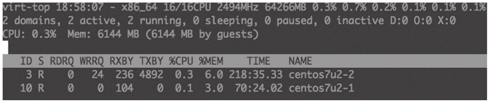

# virsh

libvirt 项目的源代码中就包含了 virsh 这个虚拟化管理工具的代码。virsh [[1\]](opeb://fe4d89f8fa873db44d15079bb4dec072/epubbook.xhtml#text00054.htmlch1_back) 是用于管理虚拟化环境中的客户机和 Hypervisor 的命令行工具，与 virt-manager 等工具类似，它也是通过调用 libvirt API 来实现虚拟化的管理的。virsh 是完全在命令行文本模式下运行的用户态工具，它是系统管理员通过脚本程序实现虚拟化自动部署和管理的理想工具之一。

virsh 是用 C 语言编写的一个使用 libvirt API 的虚拟化管理工具。virsh 程序的源代码在 libvirt 项目源代码的 tools 目录下，实现 virsh 工具最核心的一个源代码文件是 virsh.c，其路径如下：


```
[root@kvm-host ~]# cd libvirt-2.0.0
[root@kvm-host libvirt-2.0.0]# ls tools/virsh.c
tools/virsh.c
```


在使用 virsh 命令行进行虚拟化管理操作时，可以使用两种工作模式：交互模式和非交互模式。交互模式，是连接到相应的 Hypervisor 上，然后输入一个命令得到一个返回结果，直到用户使用“quit”命令退出连接。非交互模式，是直接在命令行中在一个建立连接的 URI 之后添加需要执行的一个或多个命令，执行完成后将命令的输出结果返回到当前终端上，然后自动断开连接。

使用 virsh 的交互模式，命令行操作示例如下：

------

```
[root@kvm-host ~]# virsh -c qemu+ssh://root@192.168.158.31/system
root@192.168.158.31's password:
Welcome to virsh, the virtualization interactive terminal.

Type:  'help' for help with commands
       'quit' to quit

virsh # list
 Id    Name                           State
----------------------------------------------------
 3     rhel7u2-remote                 running

virsh # quit
```

------

使用 virsh 的非交互模式，命令行操作示例如下：

------

```
[root@kvm-host ~]# virsh -c qemu+ssh://root@192.168.158.31/system "list"
root@192.168.158.31's password:
 Id    Name                           State
----------------------------------------------------
 3     rhel7u2-remote                 running
```

------

另外，在某个节点上直接使用“virsh”命令，就默认连接到本节点的 Hypervisor 之上，并且进入 virsh 的命令交互模式。而直接使用“virsh list”命令，就是在连接本节点的 Hypervisor 之后，在使用 virsh 的非交互模式中执行了“list”命令操作。

[[1\]](opeb://fe4d89f8fa873db44d15079bb4dec072/epubbook.xhtml#text00054.htmlch1) libvirt 官方网站上关于 virsh 命令行的参考手册：http://libvirt.org/sources/virshcmdref/html/。

 

## virsh 常用命令

virsh 这个命令行工具使用 libvirt API 实现了很多命令来管理 Hypervisor、节点和域，实现了 qemu 命令行中的大多数参数和 QEMU monitor 中的多数命令 [1] 。这里只能说，virsh 实现了对 QEMU/KVM 中的大多数而不是全部功能的调用，这是和开发模式及流程相关的，libvirt 中实现的功能和最新的 QEMU/KVM 中的功能相比有一定的滞后性。一般来说，一个功能都是先在 QEMU/KVM 代码中实现，然后再修改 libvirt 的代码来实现的，最后由 virsh 这样的用户空间工具添加相应的命令接口去调用 libvirt 来实现。当然，除了 QEMU/KVM 以外，libvirt 和 virsh 还实现了对 Xen、VMware 等其他 Hypervisor 的支持，如果考虑到这个因素，virsh 等工具中有部分功能也可能是 QEMU/KVM 中本身就没有实现的。

virsh 工具有很多命令和功能，本节仅针对 virsh 的一些常见命令进行简单介绍。一些更详细的参考文档可以在 Linux 系统中通过“man virsh”命令查看帮助文档。这里将 virsh 常用命令划分为 5 个类别来分别进行介绍，在介绍 virsh 命令时，使用的是 RHEL 7.3 系统中的 libvirt 2.0.0 版本，假设已经通过交互模式连接到本地或远程的一个 Hypervisor 的 system 实例上了（拥有该节点上最高的特权），以在介绍交互模式中使用的命令作为本节的示例。对于与域相关的管理，一般都需要使用域的 ID、名称或 UUID 这样的唯一标识来指定是对某个特定的域进行的操作。为了简单起见，在本节中，一般使用`<ID>`来表示一个域的唯一标识（而不专门指定为`<ID or Name or UUID>`这样冗长的形式）。另外，介绍一个输入 virsh 命令的小技巧：在交互模式中输入命令的交互方式与在终端中输入 Shell 命令进行的交互类似，可以使用`<Tab>`键根据已经输入的部分字符（在 virsh 支持的范围内）进行联想，从而找到匹配的命令。

[1] QEMU 中的命令行参数及其 monitor 中的命令，在 virsh 中的对应关系，可以参考：http://wiki.libvirt.org/page/QEMUSwitchToLibvirt。

# virt-manager

virt-manager [[1\]](opeb://fe4d89f8fa873db44d15079bb4dec072/epubbook.xhtml#text00056.htmlch1_back) 是虚拟机管理器（Virtual Machine Manager）这个应用程序的缩写，也是该管理工具的软件包名称。virt-manager 是用于管理虚拟机的图形化的桌面用户接口，目前仅支持在 Linux 或其他类 UNIX 系统中运行。和 libvirt、oVirt 等类似，virt-manager 是由 Redhat 公司发起的项目，在 RHEL 7.x、Fedora、CentOS 等 Linux 发行版中有较广泛的使用，当然在 Ubuntu、Debian、OpenSuse 等系统中也可以正常使用 virt-manager。为了实现快速开发而不太多地降低程序运行性能的需求，virt-manager 项目选择使用 Python 语言开发其应用程序部分，使用 GNU AutoTools（包括 autoconf、automake 等工具）进行项目的构建。virt-manager 是一个完全开源的软件，使用 Linux 界广泛采用的 GNU GPL 许可证发布。virt-manager 依赖的一些程序库主要包括 Python（用于应用程序逻辑部分的实现）、GTK+PyGTK（用于 UI 界面）和 libvirt（用于底层的 API）。

virt-manager 工具在图形界面中实现了一些易用且丰富的虚拟化管理功能。已经为用户提供的功能如下：

1. 对虚拟机（即客户机）生命周期的管理，如创建、修改、启动、暂停、恢复和停止虚拟机，还包括虚拟快照、动态迁移等功能。
2. 对运行中客户机实时性能、资源利用率等监控，统计结果的图形化展示。
3. 对创建客户机的图形化的引导，对客户机的资源分配和虚拟硬件的配置和调整等功能也提供了图形化的支持。
4. 内置了一个 VNC 和 SPICE 客户端，可以用于连接到客户机的图形界面进行交互。
5. 支持本地或远程管理 KVM、Xen、QEMU、LXC、ESX 等 Hypervisor 上的客户机。

在没有成熟的图形化的管理工具之时，由于需要记忆大量的命令行参数，QEMU/KVM 的使用和学习曲线比较陡峭，常常让部分习惯于 GUI 界面的初学者望而却步。不过现在情况有所改观，已经出现了一些开源的、免费的、易用的图形化管理工具，可以用于 KVM 虚拟化管理。virt-manager 作为 KVM 虚拟化管理工具中最易用的工具之一，其最新的版本已经提供了比较成熟的功能、易用的界面和不错的性能。对于习惯于图形界面或不需要了解 KVM 原理和 qemu-kvm 命令细节的部分读者来说，通过 virt-manager 工具来使用 KVM 是一个不错的选择。

# virt-viewer

virt-viewer是“Virtual Machine Viewer”（虚拟机查看器）工具的软件包和命令行工具名称，它是一个显示虚拟化客户机的图形界面的工具。virt-viewer使用GTK-VNC或SPICE-GTK作为它的显示能力，使用libvirt API去查询客户机的VNC或SPICE服务器端的信息。virt-viewer经常用于替换传统的VNC客户端查看器，因为后者通常不支持x509认证授权的SSL/TLS加密，而virt-viewer是支持的。在4.3节讲到的在virt-manager中查看客户机图形界面进行交互时，其实已经间接地使用过virt-viewer工具了。

在RHEL 7.3系统中查看virt-viewer的RPM包信息，命令行如下：

```
[root@kvm-host ~]# rpm -q virt-viewer
virt-viewer-2.0-11.el7.x86_64
```

virt-viewer的使用语法如下：

```
virt-viewer [OPTION...] -- DOMAIN-NAME|ID|UUID
```

virt-viewer连接到的客户机可以通过客户机的名称、域ID、UUID等表示来唯一指定。virt-viewer还支持“-c URI”或“--connection URI”参数来指定连接到远程宿主机上的一个客户机，当然远程连接时一些必要的认证还是必需的。关于virt-viewer工具更多详细的参数和解释，可以通过“man virt-viewer”命令查看使用手册。

# virt-install

virt-install是“Virt Install”工具的命令名称和软件包名称（在RHEL 6.x系统中，包名是python-virtinst）。virt-install命令行工具为虚拟客户机的安装提供了一个便捷易用的方式，它也是用libvirt API来创建KVM、Xen、LXC等各种类型的客户机，同时，它也为virt-manager的图形界面创建客户机提供了安装系统的API。virt-install工具使用文本模式的串口控制台和VNC（或SPICE）图形接口，可以支持基于文本模式和图形界面的客户机安装。virt-install中使用到的安装介质（如光盘、ISO文件）可以存放在本地系统上，也可以存放在远程的NFS、HTTP、FTP服务器上。virt-install支持本地的客户机系统，也可以通过“--connect URI”（或“-c URI”）参数来支持在远程宿主机中安装客户机。使用virt-install中的一些选项（--initrd-inject、--extra-args等）和Kickstart [[1\]](opeb://fe4d89f8fa873db44d15079bb4dec072/epubbook.xhtml#text00060.htmlch1_back) 文件，可以实现无人值守的自动化安装客户机系统。

在RHEL中，virt-install工具存在于“virt-install”RPM包中，查询的命令行如下：

```
[root@kvm-host ~]# rpm -q virt-install
virt-install-1.4.0-2.el7.noarch
```

使用virt-install命令启动一个客户机的安装过程，其命令行操作如下：

```
[root@kvm-host ~]# virt-install --connect qemu:///system --name centos7u2-3 --memory 1024 --disk path=/var/lib/libvirt/images/centos7u2-3.img,size=10 --network network:default --cdrom /var/lib/libvirt/images/CentOS7.2.iso --os-variant rhel7 --graphics vnc

Starting install...
Creating domain...                       |    0 B  00:00:00
```

------

上面virt-install的命令行参数中，“--connect”用于连接到本地或远程的Hypervisor（无该参数时，默认连接本地Hypervisor）；“--memory”用于配置客户机的内存大小（单位是MB）；“--disk”用于配置客户机的磁盘镜像文件，其中path属性表示路径，size属性表示磁盘大小（默认单位为GB）；“--cdrom”用于指定用于安装的ISO光盘镜像文件；“--os-variant rhel7”表示客户机是RHEL 7类型的系统（virt-install会根据这个值自动优化一些安装配置）；“--graphics vnc”表示使用VNC图形接口连接到客户机的控制台。关于virt-install工具的更多更详细参数配置，可以通过“man virt-install”命令查看相应的帮助文档。

# virt-top

virt-top是一个用于展示虚拟化客户机运行状态和资源使用率的工具，它与Linux系统上常用的“top”工具类似，而且它的许多快捷键和命令行参数的设置都与“top”工具相同。virt-top也是使用libvirt API来获取客户机的运行状态和资源使用情况的，所以只要是libvirt支持的Hypervisor，就可以用virt-top监控该Hypervisor上的客户机状态。

在RHEL 7.3系统上，virt-top命令就是在名为virt-top的RPM包中用命令行查看：

------

```
[root@kvm-host ~]# rpm -q virt-top
virt-top-1.0.8-8.el7.x86_64
```

------

直接运行“virt-top”命令后，将会显示出当前宿主机上各个客户机的运行情况，其中包括宿主机的CPU、内存的总数，也包括各个客户机的运行状态、CPU、内存的使用率，如图4-20所示。关于virt-top工具的更多更详细参数配置，可以通过“man virt-top”命令查看相应的帮助文档。



# libguestfs

libguestfs [[1\]](opeb://fe4d89f8fa873db44d15079bb4dec072/epubbook.xhtml#text00062.htmlch1_back) 是用于访问和修改虚拟机的磁盘镜像的一组工具集合。libguestfs提供了访问和编辑客户机中的文件、脚本化修改客户机中的信息、监控磁盘使用和空闲的统计信息、P2V、V2V、创建客户机、克隆客户机、备份磁盘内容、格式化磁盘、调整磁盘大小等非常丰富的功能。libguestfs支持大部分的主流客户机操作系统，如：CentOS、Fedora、Ubuntu、Windows等操作系统；libguestfs除了支持KVM虚拟机，它甚至支持VMware、Hyper-V等非开源的虚拟机。同时，libguestfs还提供了一套C库以方便被链接到自己用C/C++开发的管理程序之中。它还有对其他很多流程编程语言（如：Python）的绑定，让开发者可以方便地使用libgeustfs提供的功能构建自己的虚拟机磁盘镜像管理程序。

在RHEL 7.3系统上，查看libguestfs的常用工具在一个名为libguestfs-tools的RPM包中，可以使用如下命令查看：

```
[root@kvm-host ~]# rpm -q libguestfs-tools libguestfs-tools-c
libguestfs-tools-1.32.7-3.el7.noarch
libguestfs-tools-c-1.32.7-3.el7. x86_64
```

libguestfs-tools提供了很多工具，可以分别对应不同的功能和使用场景，如：virt-ls用于列出虚拟机中的文件，virt-copy-in用于往虚拟机中复制文件或目录，virt-copy-out用于从虚拟机往外复制文件或目录，virt-resize用于调整磁盘大小，virt-cat用于显示虚拟机中的一个文件的内容，virt-edit用于编辑虚拟机中的文件，virt-df用于查看虚拟机中文件系统空间使用情况，等等。

下面演示virt-df、virt-copy-out命令来操作一个Linux客户机：

```
[root@kvm-host ~]# virt-df -d centos7u2-1
Filesystem                   1K-blocks     Used    Available  Use%
centos7u2-1:/dev/sda1        508588        105328     403260   21%
centos7u2-1:/dev/centos/root 18307072      9764840   8542232   54%

[root@kvm-host ~]# virt-copy-out -d centos7u2-1 /tmp/test-linux.txt /tmp

[root@kvm-host ~]# cat /tmp/test-linux.txt
Hi. This is a text file in a Linux guest.
```

libguestfs的一些工具用于Windows客户机镜像的操作时，需要先安装libguestfs-winsupport这个软件包；当使用guestmount来挂载Windows镜像时，还需要安装ntfs-3g软件包（可以到EPEL中找RPM，也可以自行编译安装）。下面是使用virt-ls、virt-cat命令对Windows客户机操作的演示：

```
[root@kvm-host ~]# virt-ls -d win2012 /  #查看Windows中系统盘C盘目录
Documents and Settings
PerfLogs
Program Files
Program Files (x86)
ProgramData
my-test.txt

[root@kvm-host ~]# virt-cat -d win2012 /my-test.txt
Hi. This is a text file inside a Windows guest.
```

本节演示的命令中，使用的是“-d centos7u2-1”来指定对哪一个客户机进行操作，这里的客户机都是在运行状态的；也可以使用“-a/images/centos7u2.qcow2”这样的选项来指定一个镜像文件进行操作。

[[1\]](opeb://fe4d89f8fa873db44d15079bb4dec072/epubbook.xhtml#text00062.htmlch1) libguestfs的官方网站：http://libguestfs.org/。