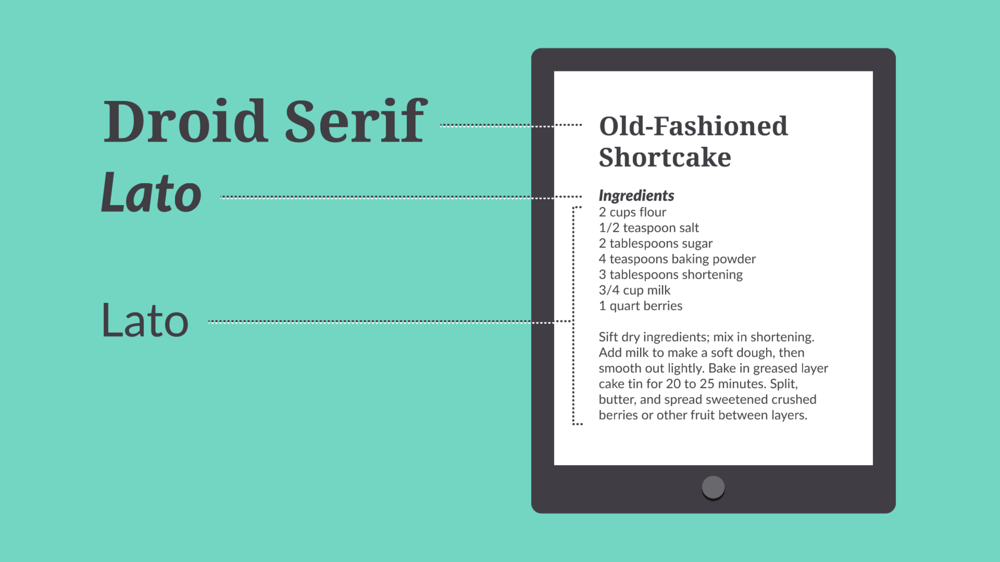
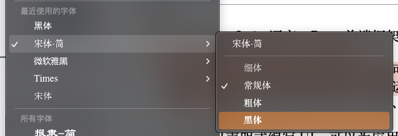
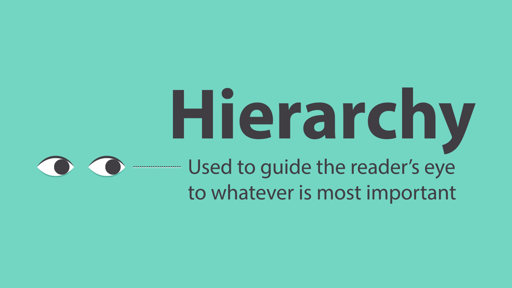
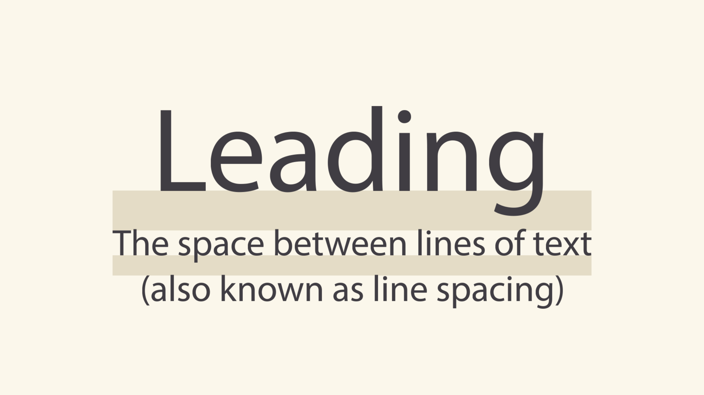
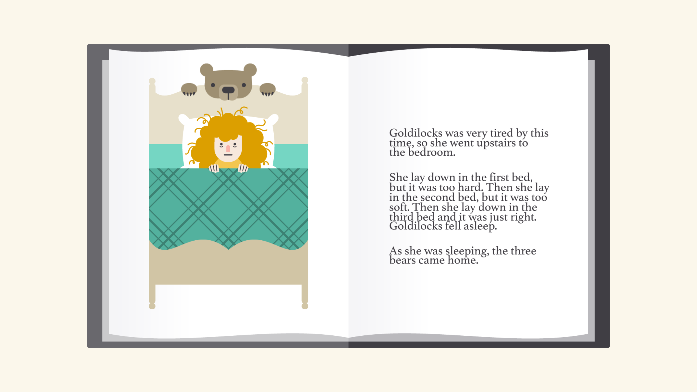
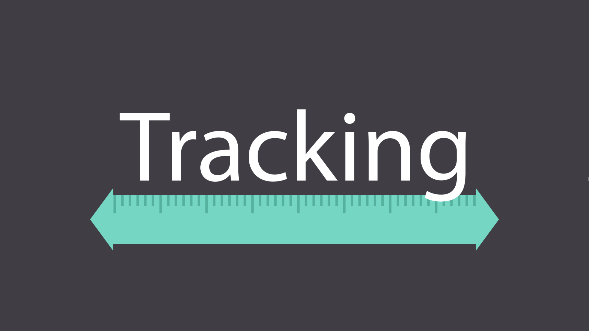
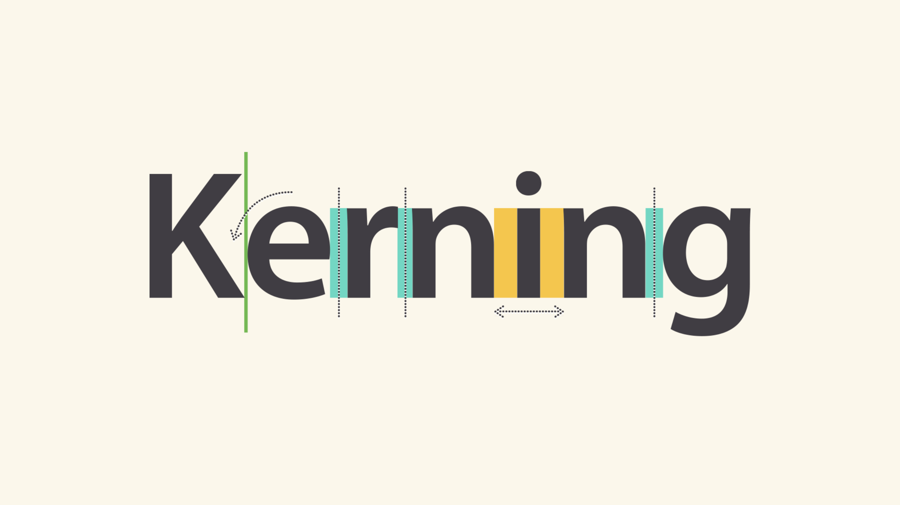

# 字体选择

每个项目的字体限制为1~2个，如果想要更高的对比度，则使用不同大小、粗细、样式来进行组合。

在我做ppt的过程中，通常选择的是**宋体或华文中宋**作为正文的内容。通过调整大小粗细来突出重点。

使用**黑体**作为标题，或者是其他用于提示性的内容。英文内容则使用**Times**字体。

字体大小的选择，最小字号为14，用于显示正文。根据内容的重点程度不同可以调到16至18，一般标题为18。

# 版面层次性

层次结构用于**将读者的注意力引导**到最重要的地方。换句话说，它使用**不同的重点**向他们展示从哪里开始以及下一步去哪里。

建立层次结构很简单：只需决定您希望读者首先注意到哪些元素，然后让它们**脱颖而出即可**。标题通常更大、更粗，或在某些方面有所不同。记住要保持简单并坚持一些互补的风格。

# 行距

行距通常为1.5到2左右的字高。

# 总-字间距

指的是一行字的长度。这可以 根据需求压缩或者扩展。

# 字间距

字距是**特定字符之间**的**空格**。与跟踪不同，它在单词的整个过程中会发生变化，因为每个字母的组合方式不同。

