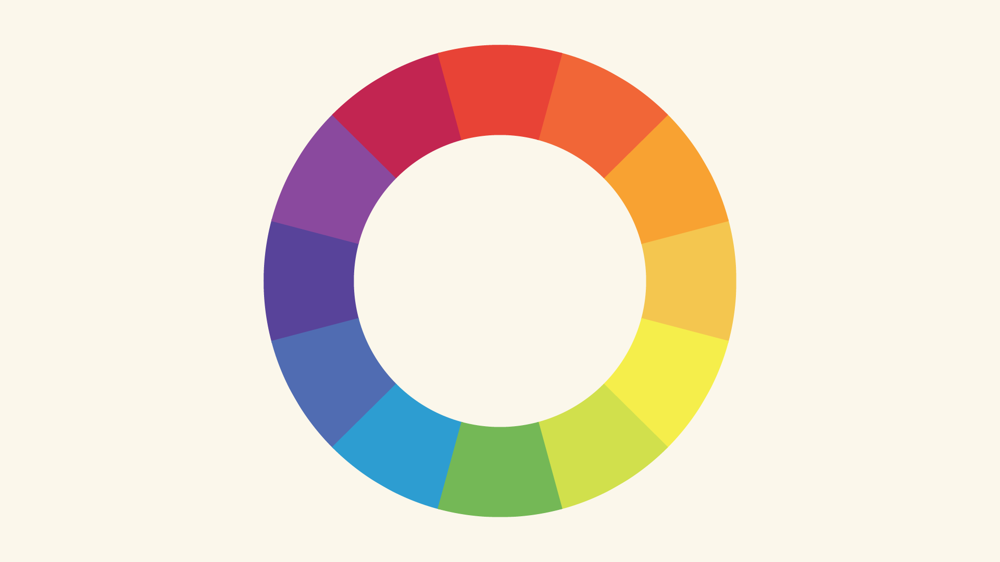

# 基础色彩理论

红、黄、蓝三个主色互相组合产生了橙、绿、紫三个副色。

- 红+黄=橙
- 黄+蓝=绿
- 蓝+红=紫

继续进行互相组合，又产生了中间的颜色，这12个颜色称为色轮。

## 色相、饱和度、值（Hue, saturation, value）

或者称为 HSB，brightness

- 色相就是单纯的颜色。
- 饱和度指的是颜色的强度。
- 色值指的是颜色的深浅。

以ppt色盘为例

- 标放在最边缘时就是饱和度拉到最高时的颜色，饱和度越低就越接近于灰色。
- 色相就是半径不变，光标绕整个色盘一个圈。这个圈就是上面的色轮不断组合出来的结果。
- 色值（亮度）代表颜色神奇那，亮度越低，则越接近于黑色。

## 常见搭配方案

### 单色

选择同一种颜色，然后调节其饱和度和亮度，即可产生一种搭配

这样的选择最稳妥，不会翻车，但是容易单调。

### 双色

邻近色搭配，在色换上选择相邻的颜色

对比色搭配，在色环相反的位置上选择颜色，对比强烈。

可以选择不同的饱和度和亮度来增加多样性。

### 三色

长三角型，可以使用更多的配色

邻近色

正三角

### 四色

长方形搭配，一般一种颜色作为主色，其他的作为配色。

正方形搭配

# 常见错误解决

在搭配中可能会出现非常瞎眼的配色

这种通常可以通过改变其亮度和饱和度来解决。

在一个页面上的色彩不应该过多

而是通过中性的颜色，如黑色、白色、灰色来平衡设计

明亮的颜色通常生动活泼一点

饱和度低的通常较为严肃和务实。

也可以参考出名的作品

# 配色网站推荐

https://coolors.co/palettes/trending

https://colorhunt.co/palettes/popular

这两个网站包含了一些常用的色彩搭配。并且第一个网站可以生成新的搭配。

# 常用色彩选择

在ppt中有着预置的色彩搭配，比如这个web safe colors，在网页中用的比较多。

开发者搭配还写了一些标题建议选择什么颜色

