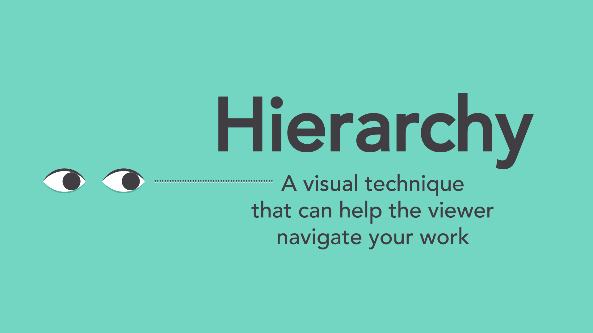

# 排版与构图

## 分组

将相关的东西分组，并且组与组之间进行隔离。即有一定的空白，或者是其他的分界线，用于强调元素之间的关系。

## 留白

留白并不意味着字面上的空白，而是代表着有空余空间，如内容与内容之间，行与行之间，甚至外边距的空间。

如果整个页面看起来有点杂乱，则不妨试试重新排列以留白

## 对齐

对齐使整个页面更加整洁

## 对比

例如使用颜色、文本样式、文本大小进行对比

### 层次感

想要建立层次感，则只需要取放大、修改他们的样式，突出他们即可。

## 重复

在每个项目、页面中，应当有一致的外观搭配。

例如保持一致的字体样式、配色方案。

